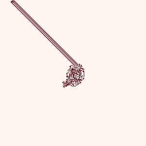
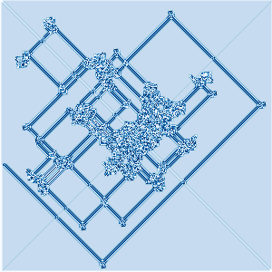
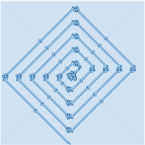
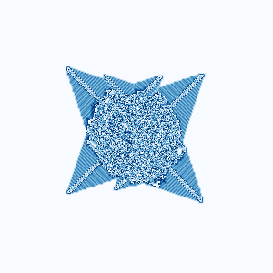
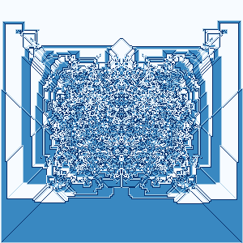

Advanced Langton's Ant
======================

This is a [Rust] application that generates images and videos of multi-colour [Langton's Ant] walks.

<https://gitlab.com/claudiomattera/advanced-langton-ant/>

Installation
----

Executables for Linux and Windows can be found in the [releases page](https://gitlab.com/claudiomattera/advanced-langton-ant/-/releases).

### From source

This application can be compiled using the Rust toolchain.

~~~~shell
cargo build --release
~~~~

The resulting executable will be created in `target/release/advanced-langton-ant`.

Usage
----

This is a command-line application.
It can be configured using command-line arguments, as described in the help message:

    > advanced-langton-ant --help
    advanced-langton-ant 0.1.0
    Claudio Mattera <claudio@mattera.it>

    USAGE:
        advanced-langton-ant [FLAGS] [OPTIONS] [SUBCOMMAND]

    FLAGS:
        -h, --help       Prints help information
        -V, --version    Prints version information
        -v, --verbose    Sets the level of verbosity

    OPTIONS:
        -l, --lifetime <lifetime>    Ant lifetime [default: 100000]
        -p, --palette <palette>      Color palette [default: blue]  [possible values: blue, red, set1]
        -r, --rule <rule>            Ant rule [default: LR]
        -s, --size <size>            Grid size [default: 100]

    SUBCOMMANDS:
        help           Prints this message or the help of the given subcommand(s)
        save-frames    Save board progression as frames
        save-image     Save final board status as an image

    Some interesting rules:
     * LR (original highway)
     * LRRL (symmetric growth)
     * LRRRRRLLR (diagonal tubes)
     * RRLLLRLLLRRR (growing triangle)
     * RRLLLRRL (ninja star)
     * LRRRRLLLRRR (Archimedes' spiral)
     * LRRRRRRRLRLLRRRRRLRRRRRRLRLRLRLRLRLRLLRRLLRRLLR (more diagonal tubes)

### Examples (images)

The images at the top of this page were generated using the following commands

~~~~shell
advanced-langton-ant -v --size 300 --lifetime 1000000000 \
    --rule LR --palette red \
    save-image --path LR.png
advanced-langton-ant -v --size 300 --lifetime 1000000000 \
    --rule LRRRRRLLR --palette blue \
    save-image --path LRRRRRLLR.png
advanced-langton-ant -v --size 300 --lifetime 1000000000 \
    --rule LRRRRLLLRRR --palette blue \
    save-image --path LRRRRLLLRRR.png
advanced-langton-ant -v --size 300 --lifetime 1000000000 \
    --rule RRLLLRRL --palette blue \
    save-image --path RRLLLRRL.png
advanced-langton-ant -v --size 300 --lifetime 1000000000 \
    --rule LRRL --palette blue \
    save-image --path LRRL.png
~~~~

### Example (videos)

This application can generate a series of frames corresponding at various iterations during the ant's walk.
Those frames can then be joined in a video using a program such as [ffmpeg].

~~~~shell
mkdir LRRRRRLLR-frames
advanced-langton-ant -v --size 500 --lifetime 1000000 \
    --rule LRRRRRLLR --palette red save-frames --path LRRRRRLLR-frames/
ffmpeg -framerate 30 -f image2 -i "LRRRRRLLR-frames/%09d.png" -c:v h264 \
    -profile:v high444 -q:v 0 -pix_fmt yuv444p -preset medium \
    -r 30 -y LRRRRRLLR.mp4
rm -f LRRRRRLLR-frames/*
rmdir LRRRRRLLR-frames
~~~~

License
----

Copyright Claudio Mattera 2020

You are free to copy, modify, and distribute this application with attribution under the terms of the [MIT license]. See the [`License.txt`](./License.txt) file for details.

Some of the colour schemes included in this application come from [ColorBrewer] website, and are distributed under the [Apache 2 License].

[Langton's Ant]: https://en.wikipedia.org/wiki/Langton%27s_ant
[Rust]: https://rust-lang.org/
[ffmpeg]: https://ffmpeg.org/
[MIT license]: https://opensource.org/licenses/MIT
[ColorBrewer]: https://colorbrewer2.org/
[Apache 2 License]: https://opensource.org/licenses/Apache-2.0

Inspiration
----

This application was inspired by [this daily programmer thread](https://www.reddit.com/r/dailyprogrammer/comments/2c4ka3/7302014_challenge_173_intermediate_advanced/):

> If you've done any work or research onto cellular automata, you may have heard of Langton's Ant. It starts with a grid similar to that of Conway's Game of Life where a grid cell can be black or white, however this time we have an 'ant' on it. This little metaphorical ant will follow these four rules at every 'step':
> 
> * If the current square is white, turn the ant 90' clockwise
> * If the current square is black, turn the ant 90' anticlockwise
> * Flip the colour of the current square
> * Move forward (from the ant's perspective) one cell
> 
> With the following starting conditions:
> 
> * All cells start white
> * The ant starts pointing north
> 
> However, being /r/DailyProgrammer, we don't do things the easy way. Why only have 2 colours, black or white? Why not as many colours as you want, where you choose whether ant turns left or right at each colour? Today's challenge is to create an emulator for such a modifiable ant.
> 
> If you have more than 2 colours, of course, there is no way to just 'flip' the colour. Whenever the ant lands on a square, it is to change the colour of the current square to the next possible colour, going back to the first one at the end - eg. red, green, blue, red, green, blue, etc. In these cases, at the start of the simulation, all of the cells will start with the first colour/character.
> 
> Input Description
> -----------------
> 
> You will be given one line of text consisting of the characters `L` and `R`, such as:
> 
>     LRLRR
> 
> This means that there are 5 possible colours (or characters, if you're drawing the grid ASCII style - choose the colours or characters yourself!) for this ant.
> 
> In this case, I could choose 5 colours to correspond to the `LRLRR`:
> 
> * White, turn left (anticlockwise)
> * Black, turn right (clockwise)
> * Red, turn left (anticlockwise)
> * Green, turn right (clockwise)
> * Blue, turn right (clockwise)
> 
> You could also choose characters, eg. ` `, `#`, `%`, `*`, `@` instead of colours if you're ASCII-ing the grid. You will then be given another line of text with a number $N$ on it - this is the number of 'steps' to simulate.
> 
> Output Description
> ------------------
> 
> You have some flexibility here. The bare minimum would be to output the current grid ASCII style. You could also draw the grid to an image file, in which case you would have to choose colours rather than ASCII characters. I know there are some people who do these sorts of challenges with C/C++ curses or even more complex systems.
> 
> Notes
> =====
> 
> [More info on Langton's Ant with multiple colours](http://en.wikipedia.org/wiki/Langton%27s_ant#Extension_to_multiple_colors).
